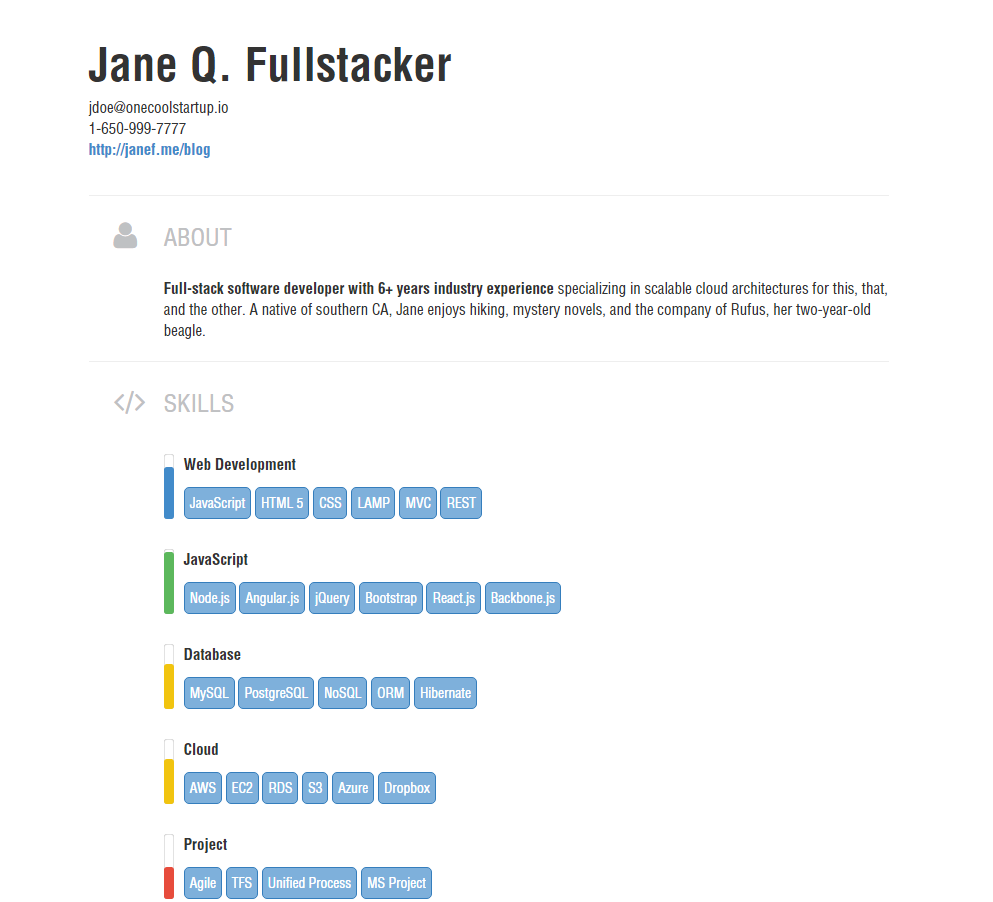

Theme: Modern-Lancer
===============
A contemporary technical résumé theme with tweaks for freelancers. Features colored progress bars
representing skill levels and Font Awesome icons for section headers. 
Adds a picture and projects to the standard modern theme. 
Also adds social info to contact data for Github/Bitbucket and the like, puts an image to the right, 
renames the employment section to work, adds a section for languages and extracurricular.



## Use

Note: In order to display colored progress bars as in the below image, your resume should include a `level` annotation for each skill:

```json
{
  "name": "JavaScript",
  "level": "master",
  "skills": [
    "Node.js", "Angular.js", "jQuery", "Bootstrap", "React.js", "Backbone.js"
  ]
},
{
  "name": "Database",
  "level": "intermediate",
  "skills": [
    "MySQL", "PostgreSQL", "NoSQL", "ORM", "Hibernate"
  ]
}
```

Valid values for `level` are `master`, `advanced`, `intermediate`, `beginner`,
or a number between 1 and 10.

## License

MIT. See [LICENSE.md][lic] for details.

[lic]: https://github.com/fluentdesk/fresh-themes/blob/master/LICENSE.md
